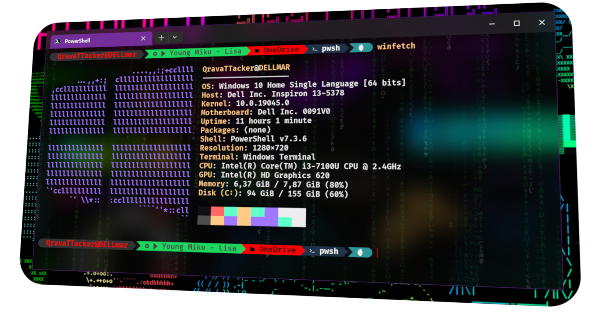

       
       
      

## **_Ferramentas que serão Instaladas_**:

### I. Programas Base

- Windows Terminal
- Power Shell +7.0.0
- Winget
- Visual Studio Code
- Neo Vim

### II. Customizando o Terminal 

- Fontes
- Tema de cores
- Oh My Posh
- Terminal Icons
- PSReadLine
- Config Settings.json
- Config $PROFILE

### III. Softwares Extras

- Git
- GitHub Desktop
- WSL + Linux
- Python, NodeJS, GCC/LLVM, JDK, PHP etc.
- Power Toys
- ZoomIt
